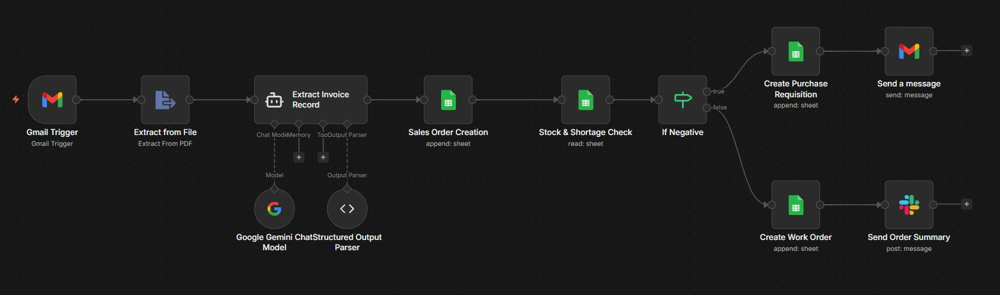
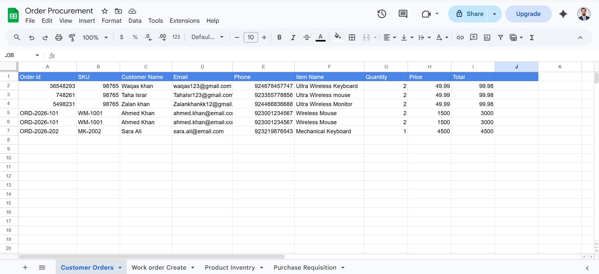
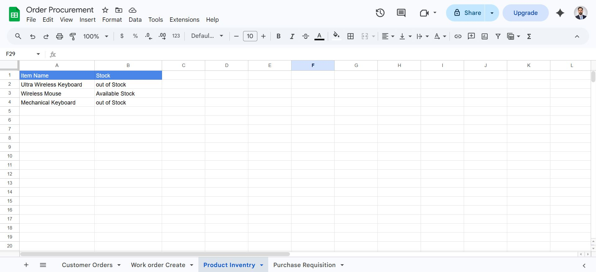
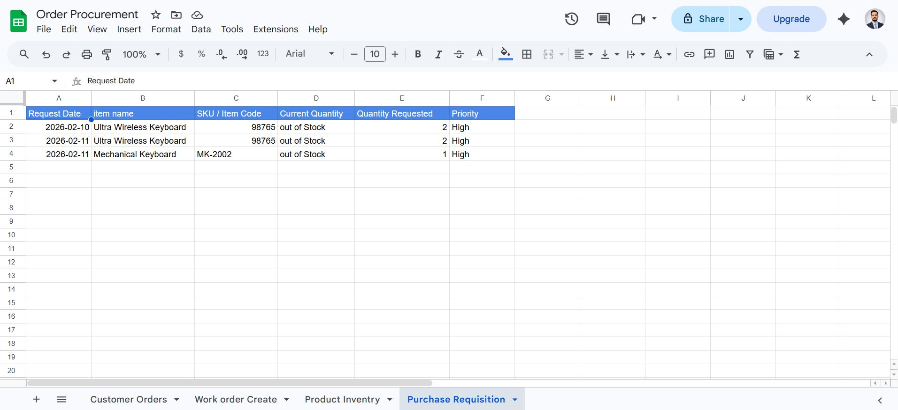
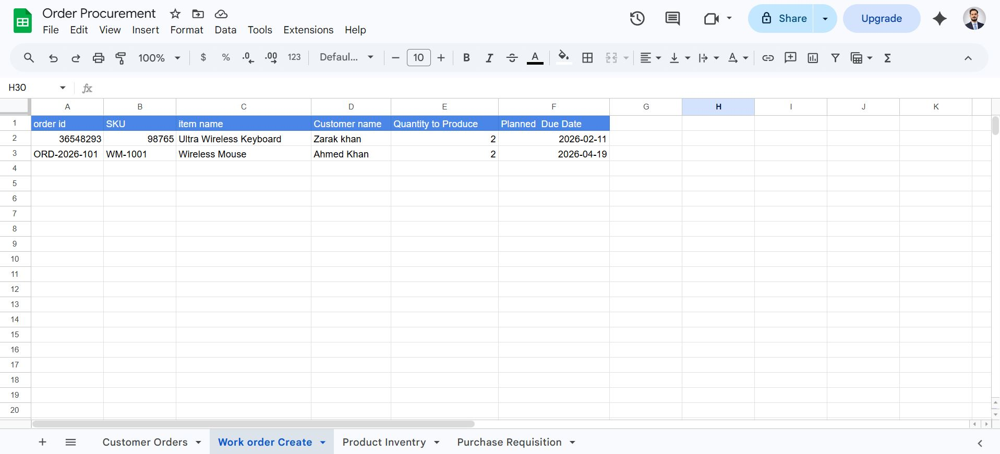

# InvoiceProcessingN8N

AI-powered invoice processing automation for small and medium businesses using n8n.

## 🚀 Main Workflow: Invoice Processing

### How It Works

1. **Gmail Trigger** - Watches inbox for new invoice emails, downloads PDF attachments
2. **Extract from File** - OCR converts PDF to text
3. **AI Data Extraction** - Google Gemini AI extracts: Order ID, SKU, Customer Name, Email, Phone, Item Name, Quantity, Price, Total
4. **Sales Order Creation** - Saves data to Google Sheets
5. **Stock Check** - Checks inventory levels
6. **Smart Decision** - If out of stock:
   - Creates Purchase Requisition (buys more inventory)
   - Creates Work Order (manufactures item)
7. **Notifications** - Email for purchases, Slack for work orders

### Key Nodes
- Gmail Trigger, Extract from File, Google Gemini AI, Structured Output Parser, Extract Invoice Record, Google Sheets, If node, Gmail/Slack notifications

---

## 📋 Supporting Workflows

### Customer Order Workflow

Processes and validates customer orders, checks availability, updates records.

### Product Inventory Workflow

Tracks stock levels in real-time, updates automatically, prevents stockouts.

### Purchase Requisitions Workflow

Auto-generates purchase requests when stock is low, tracks requisitions, sets priorities.

### Work Order Creation Workflow

Creates production orders, sets due dates, links to customer orders, tracks progress.

---

## 🎯 Approach

1. **Problem**: Manual invoice processing is slow and error-prone
2. **Tools**: n8n + Google Gemini AI + Google Sheets + Gmail + Slack
3. **Flow**: Receive → Extract → Store → Check → Act → Notify
4. **Intelligence**: AI extracts data from any invoice format
5. **Automation**: System decides purchase vs produce based on stock
6. **Communication**: Auto notifications keep team informed

---

## 💰 ROI

- **Time**: 90% faster processing (5-10 min → <1 min per invoice)
- **Cost**: $5K-$15K annual savings from reduced labor and errors
- **Revenue**: 10-20% increase from faster processing and fewer stockouts
- **Scale**: Handles unlimited invoices without extra staff

| Metric | Before | After | Improvement |
|--------|--------|-------|-------------|
| Processing Time | 5-10 min | <1 min | 90% faster |
| Errors | 5-10% | <1% | 80-90% reduction |
| Stockouts | Monthly | Rarely | 80% reduction |
| Admin Time | 20+ hrs/week | <5 hrs/week | 75% reduction |

---

## 🤖 How It Helps Humans

- **Business Owners**: Focus on growth, not paperwork
- **Admin Staff**: No manual data entry, fewer errors
- **Sales Teams**: Faster order confirmations, accurate inventory info
- **Production Teams**: Automatic work orders, better planning
- **Customers**: Faster service, accurate orders, reliable delivery

---

## 🔧 Tech Stack

- n8n (workflow automation)
- Google Gemini AI (data extraction)
- Google Sheets (data storage)
- Gmail API (email processing)
- Slack API (notifications)

---

##  Setup

1. Import `Invoice Processing.json` into n8n
2. Configure Gmail, Gemini AI, Google Sheets, Slack credentials
3. Update sender email filter
4. Activate workflow

---

Built by Zakeen Khan for SMB invoice automation.
